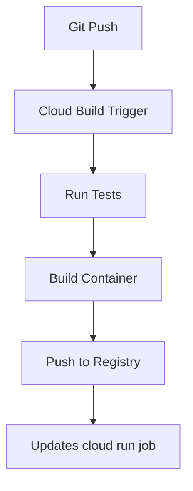

# Event Summary Batch Job – Cloud Run
**Cloud Run Job** that aggregates JSON event data from **GCS** into hourly CSV summaries and uploads results to **Cloud Storage** and **BigQuery**. Scheduled via **Cloud Scheduler** with **CI/CD** through **Cloud Build**.

---

## Features

* Runs daily using **Cloud Scheduler**
* Reads raw JSON event data older than 24 hours from `events/YYYY/MM/DD/` in GCS
* Aggregates events by hour and event type (e.g., `click`, `view`, `purchase`)
* Writes hourly summaries to `summary/YYYY/MM/DD/` in GCS
* Loads data into a partitioned BigQuery table
* Ensures no duplicate data is loaded (based on event hour)
* Supports **CI/CD** deployment with Cloud Build on Git tags (e.g., v1.0.0)

---

## Project Structure

```bash
.
├── main.py                     # main script for Cloud Run job
├── requirements.txt            # Python dependencies
├── cloudbuild.yaml             # Cloud Build config for CI/CD
├── bigquery_schema.json        # BigQuery schema definition
├── test_main.py                # unit tests
├── dockerfile 	                # dockerfile with container specs
└── .dockerignore
├── event_data_generator.py     # Not required - this is used for generating sample source data

```

---

## System Workflow


### How It Works

* Cloud Scheduler triggers the Cloud Run job daily at 2am via HTTP Post Request
* The Cloud Run Job fetches raw events older than 24 hours from the respective GCS Bucket.
* Events are grouped by hour and shows the number of events for that hour
* The job writes the summary as a CSV file to a different GCS Bucket into appropriate folder
* The CSV File is first loaded into staging table with Truncate & Load mode
* Records are upserted into main table ensuring no duplicates

### Example Output Schema
Each row in the summary contains an hour and the count of each event type:

```csv
hour,click_event_count,view_event_count,purchase_event_count
2025-05-06T14:00:00,10,3,0
  ```

---

## CI/CD Pipeline

The Cloud Build CI/CD pipeline automatically handles the entire development lifecycle

The Cloud Build pipline gets triggered on the GitHub repository Git tag (e.g., v1.0.0)

1. Runs unit tests
2. Builds the Docker container
3. Pushes the container to Google Artifact Registry
4. Updates the cloud run job with new version of the image



## Local Development

### Prerequisites

- Python 3.9 or higher
- Google Cloud SDK installed and configured
- Docker (for container development)
- google cloud storage, bigquery API enabled
- Two google cloud storage bucket - event-data-raw and event-data-summary
- GCP service account with bigquery and gcs access

### Setup Steps

1. Clone the repository
   ```bash
   git clone https://github.com/royal-dsouza/event-summary-batch-job
   cd csv-metrics-reporter
   ```

2. Set up a virtual environment
   ```bash
   python -m venv venv
   source venv/bin/activate  # On Windows: venv\Scripts\activate
   ```

3. Install dependencies
   ```bash
   pip install -r requirements.txt
   ```

4. Create bigquery table
   ```bash
   bq mk --table \
    --schema /Users/royaldsouza/Documents/GCP/event-summary-batch-job/bigquery_schema.json \
    <project_id>:platform_event_data.event_hourly_summary_staging
    
    bq mk --table \
    --schema /Users/royaldsouza/Documents/GCP/event-summary-batch-job/bigquery_schema.json \
    --time_partitioning_field "hour" \
    --time_partitioning_type "DAY" \
     <project_id>:platform_event_data.event_hourly_summary
   ```

5. Configure environment variables
   ```bash
    export SOURCE_BUCKET=event-data-raw
    export SUMMARY_BUCKET=event-data-summary
    export BIGQUERY_DATASET=platform_event_data
    export BIGQUERY_TABLE=event_hourly_summary
    export HOURS_THRESHOLD=24
    export GOOGLE_APPLICATION_CREDENTIALS="path/to/service-account-key.json"
   ```

6. Run tests
   ```bash
   python -m pytest tests/ -v
   ```

7. Start local development server
   ```bash
   python main.py
   ```

8. Build and test locally with Docker
   ```bash
   docker build -t event-processor .
   docker run -p 8080:8080 \
     -e SOURCE_BUCKET="event-data-raw" \
     -e SUMMARY_BUCKET="event-data-summary" \
     -e BIGQUERY_DATASET="platform_event_data" \
     -e BIGQUERY_TABLE="event_hourly_summary" \
     -e HOURS_THRESHOLD="24"
     -e GOOGLE_APPLICATION_CREDENTIALS="path/to/service-account-key.json" 
     event-processor
   ```

## Cloud Deployment

### GCP Project Setup

1. Enable required APIs
   ```bash
   gcloud services enable \
    run.googleapis.com \
    cloudbuild.googleapis.com \
    storage.googleapis.com \
    bigquery.googleapis.com \
    cloudscheduler.googleapis.com \
    logging.googleapis.com \
    iam.googleapis.com
   ```

2. Configure service accounts and IAM roles
   ```bash
    # Variables
    PROJECT_ID=$(gcloud config get-value project)
    SERVICE_ACCOUNT_NAME=event-batch-job-sa
    SERVICE_ACCOUNT_EMAIL=${SERVICE_ACCOUNT_NAME}@${PROJECT_ID}.iam.gserviceaccount.com
    
    # Create service account
    gcloud iam service-accounts create ${SERVICE_ACCOUNT_NAME} \
      --display-name="Cloud Run Batch Job Service Account"
    
    # Bind required IAM roles to the service account
    gcloud projects add-iam-policy-binding ${PROJECT_ID} \
      --member="serviceAccount:${SERVICE_ACCOUNT_EMAIL}" \
      --role="roles/storage.objectAdmin"
    
    gcloud projects add-iam-policy-binding ${PROJECT_ID} \
      --member="serviceAccount:${SERVICE_ACCOUNT_EMAIL}" \
      --role="roles/bigquery.dataEditor"
    
    gcloud projects add-iam-policy-binding ${PROJECT_ID} \
      --member="serviceAccount:${SERVICE_ACCOUNT_EMAIL}" \
      --role="roles/run.invoker"
    
    gcloud projects add-iam-policy-binding ${PROJECT_ID} \
      --member="serviceAccount:${SERVICE_ACCOUNT_EMAIL}" \
      --role="roles/logging.logWriter"
    
    gcloud projects add-iam-policy-binding ${PROJECT_ID} \
      --member="serviceAccount:${SERVICE_ACCOUNT_EMAIL}" \
      --role="roles/iam.serviceAccountUser"
    
    gcloud projects add-iam-policy-binding ${PROJECT_ID} \
      --member="serviceAccount:${SERVICE_ACCOUNT_EMAIL}" \
      --role="roles/cloudscheduler.jobRunner"
   ```

3. Create Repository in Artifact Registory
   ```bash
      gcloud artifacts repositories create event-processor-repo \
        --repository-format=docker \
        --location="us-central1"
   ```

4. Create the cloud run job
   ```bash
     gcloud run jobs create event-processor-job \
      --image=us-central1-docker.pkg.dev/$PROJECT_ID/event-processor-repo/event-processor \
      --region=us-central1 \
      --cpu=1 \
      --memory=2Gi \
      --max-retries=3 \
      --task-timeout=3600s \
      --set-env-vars=SOURCE_BUCKET=event-data-raw,SUMMARY_BUCKET=event-data-summary,BIGQUERY_DATASET=platform_event_data,BIGQUERY_TABLE=event_hourly_summary,BIGQUERY_STG_TABLE=event_hourly_summary_staging,HOURS_THRESHOLD="24"
   ```

4. Setup cloud scheduler
   
setup cloud scheduler to trigger cloud run job daily at 2am
   ```bash
   gcloud scheduler jobs create http daily-event-processor \
    --schedule="0 2 * * *" \
    --uri="https://us-central1-run.googleapis.com/apis/run.googleapis.com/v1/namespaces/<project-id>/jobs/event-processor-job:run" \
    --http-method=POST \
    --oauth-service-account-email=<service-account-id> \
    --location=us-central1
   ```

6. Update substitutions in cloudbuild.yaml

```yaml
substitutions:
  _SOURCE_BUCKET: event-data-raw
  _SUMMARY_BUCKET: event-data-summary
  _BIGQUERY_DATASET: platform_event_data
  _BIGQUERY_TABLE: event_hourly_summary
  _BIGQUERY_STG_TABLE: event_hourly_summary_staging
  _HOURS_THRESHOLD: "24"
  _REPO_NAME: event-processor-repo
```

6. Create Cloud Build trigger
   
Follow these steps to automate build and deployment of your Cloud Run Job using Cloud Build when a Git tag (e.g., v1.0.0) is pushed:
- Navigate to Cloud Build > Triggers
- Click "Create Trigger"
- Connect to GitHub repository
- Configure trigger settings:
   - Name: `event-summary-job-trigger`
   - Event: `Push new tag`
   - Repository: `your_repository`
   - Tag (regex): `^v[0-9]+.*$`
   - Configuration: `Cloud Build configuration file (YAML)`
   - Location: `Repository`
   - File: `cloudbuild.yaml`


